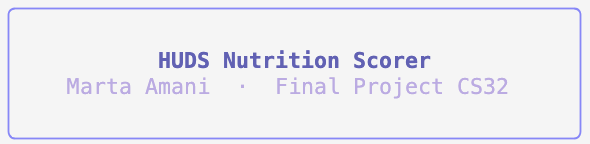
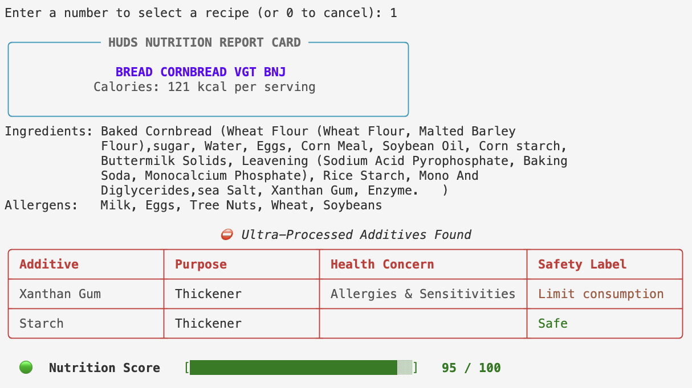
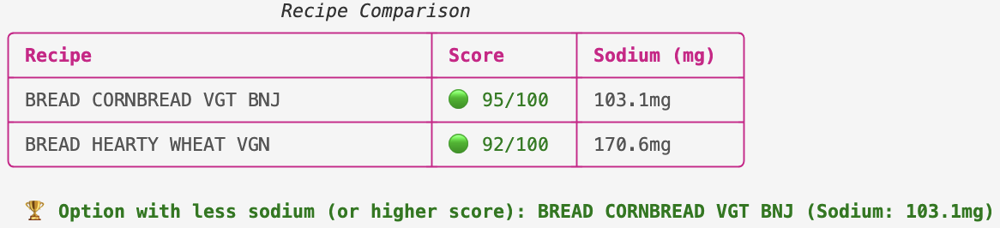

# BioJump - HUDS Nutrition Scorer
### Final project for the class CS32 Spring 2026, at Harvard University.


## What This Project Does
This project analyzes the ingredients of the Harvard University Dining Services (HUDS) recipes using the Harvard Dining API.
Given a dish name, the Python program:
1. Fetches the recipe’s ingredients and nutrition information from the HUDS API.
2. Parses the ingredient list and matches it against:
   - A CSV of ultra‑processed additives
   - Dietary preferences (vegan, vegetarian, gluten‑free, nut‑free)
3. Generates a **report card** for each recipe, that includes
    - **Nutrition Info**, including a full list of ingredients and allergens
    - **Color-coded additive list**, showing which ultra-processed additives were detected
    - **Nutrition Score**, based on the additives present in the recipes, categorized according to a NOVA-inspired classification system.


The user interacts with the HUDS Nutrition Scorer via the terminal:
The program first asks for **dietary preferences** (vegan, vegetarian, gluten-free, nut-free). Then it prompts for a recipe name and searches the HUDS database:
- If there is a recipe that exactly matches the input, then the report card for that recipe will be displayed;
- If there is not an exact match, then the possible matches are printed in the terminal, and the user/student is asked to select one based on its number in the list;
- If there is no match, the user is asked to input a different recipe name.

The program keeps a **session history** of all searched recipes. Once at least two recipes have been searched, the user can **compare recipes** on processing score, protein, sodium, or dietary fiber.


## Setup
This project uses the Harvard Dining API, which requires a personal API key.
To obtain an API Key, Harvard students are required to go to https://portal.apis.huit.harvard.edu, then go to the API Catalog and search for "Dining API". After creating an app, students can obtain an API Key.

Then, in the codespace, create a file called .env, which allows storing sensitive information like the API_Key as key-value pairs, while keeping them out of the source code and not available to the public. The document .env.example shows the user the type of input required.

Then, I created a CSV file containing a list of ultra-processed additives used for scoring. The file has the following columns: additives, category, description.

To successfully run the code, the user is required to install the required packages `request`, `python-dotenv`, and `rich`. In the terminal, the user should type:

```
$ pip install requests python-dotenv rich
```

## Usage
The script will be called `FP.py` and its execution looks like the following, where the user types their dietary preference and the recipe name:
```
$ python3 FP.py
```


```
Do you have any dietary preferences? Type 'y' for yes, anything else for no.
y

Dietary filters (optional). Type 'y' for yes, anything else for no.
Vegan? (y/n): y
Vegetarian? (y/n): n
Gluten-free? (y/n): n
Nut-free? (y/n): n

Which recipe would you like to search? (or 'q' to quit): Muffin
Searching recipe from the Harvard University Dining Service
```
After the search is completed, the script will print the recipe report card, or it will print "No exact match found for "_user input_". Here are similar recipes:" if it cannot find a recipe that exactly matches the user's input.

Here is an example:
```
Which recipe would you like to search? (or 'q' to quit): Bread
Searching recipe from the Harvard University Dining Service

No exact match found for "Bread". Here are similar recipes:
1. BREAD CORNBREAD VGT BNJ
2. BAG LUNCH BREAD HEARTY WHITE
3. BREAD HEARTY WHEAT VGN
4. BREAD BAGUETTE VGN MYO BARS
5. BREAD COUNTRY LOAF RND WHITE VGT VGN MYO
6. BREAD LOAF WHOLE GRAIN VGT  MYO
7. BREAD APPLE CARAMEL TEA VGT
8. BREAD PITA BRAIN BREAK
9. BREAD NAAN
10. BREAD GARLIC  SLICED VGT
11. DESSERT PUDDING MAPLE & APPLE BREAD VGT
12. BREAD LEMON TEA VGT
13. PICKLES BREAD & BUTTER CWK
14. BREAD NAAN GH
```

The file `HUDS_recipes.txt` contains the full list of HUDS recipes.

The report card, which includes a nutrition summary, color-coded additive list, and processing score, looks as follows:


<br>
<br>

The file `additives.csv` contains the full list of additives.
<br>
<br>
The user is then asked if they want to search more recipes. The searched recipes are stored in the `history` list. Once the list contains at least 2 recipes, the user is asked if they want to compare the recipes. If so, they can choose from the history list and choose which category they want to compare:
<br>

```
Would you like to compare all searched recipes so far? Type 'y' for yes, anything else for no.
y

Recipes searched so far:
  1. BREAD CORNBREAD VGT BNJ
  2. BREAD NAAN
  3. BREAD HEARTY WHEAT VGN

Enter the number of the recipes you want to compare (e.g. 1,2, etc.) 1,3

What would you like to compare? Type 'A' for additives found, 'P' for Protein, 'S' for Sodium, 'F' for Dietary Fiber.
S
```
A Recipe Comparison table is printed, such that the user is informed about the best option.


<br>
<br>

Once the user is done, they can type 'q' to quit and the program stops.
```
Which recipe would you like to search? (or 'q' to quit): q

Goodbye!
```

## External Sources and Citations

- The list of ultra-processed additives in `additives.csv` is based on:

    Center for Science in the Public Interest - "Chemical Cuisine: Food Additive Safety Rating"

    https://www.cspi.org/page/chemical-cuisine-food-additive-safety-ratings

- Harvard Dining API:

    https://portal.apis.huit.harvard.edu/docs/ats-dining/1/overview


## Use of Generative AI
I used generative AI tools (Anthropic's Claude and OpenAI's ChatGPT) as assistants during the development of this project. The code for the report card, which leverages Python's `rich` library features, was partially written with AI assistance. In particular, the structure and rich formatting syntax (`Panel`, `Table`, `Progress Bar`) were generated with AI help. I adapted the output labels, colors, and layout to match my project's design, and extended the report card with more personalized features.

Additionally, generative AI provided explanations for setting up the `.env` file and configuring `.gitignore`.
